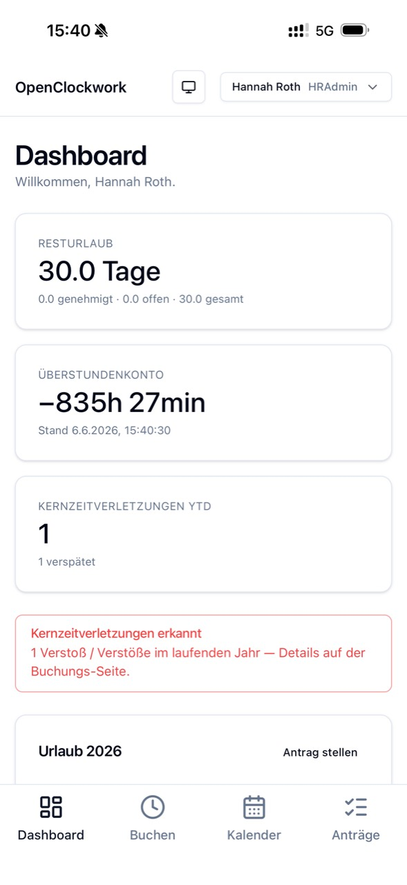
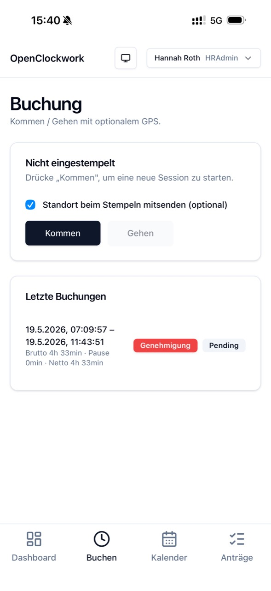
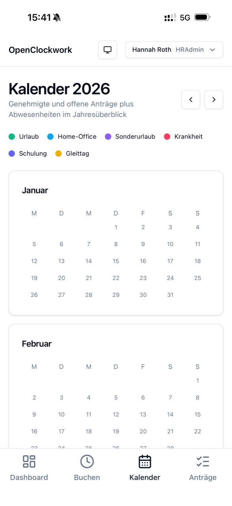
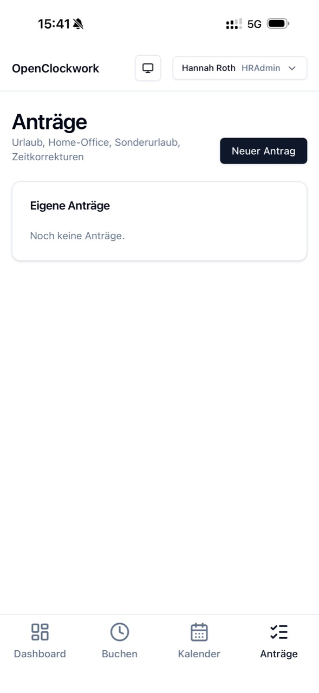
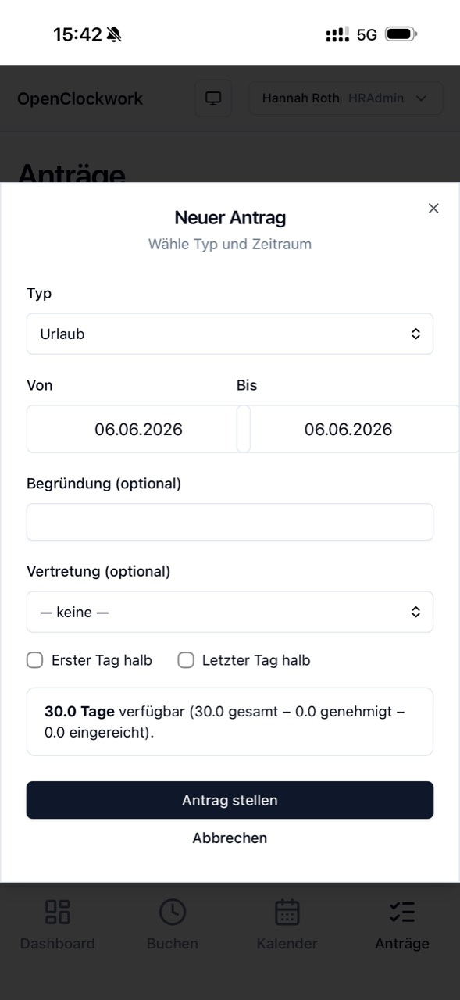

# OpenClockwork Features

OpenClockwork is a mobile-first, self-hostable time-and-attendance system for
small and mid-sized organisations. Its domain model focuses on German
working-time workflows while keeping deployment and integration under the
operator's control.

> **Project status:** Beta. The capabilities below are implemented and covered
> by automated tests. APIs, schemas, and user flows may still evolve before the
> first stable release.

## Mobile PWA

The responsive web application can be installed as a Progressive Web App and
provides role-aware navigation for employees, managers, and HR administrators.

<p align="center">
  
  
  
</p>

<p align="center">
  
  
</p>

## Employee Experience

| Capability                        | What it provides                                                                                                            |
| --------------------------------- | --------------------------------------------------------------------------------------------------------------------------- |
| Personal dashboard                | Vacation balance, overtime account, and detected core-time violations at a glance                                           |
| Clock in and out                  | PWA-based time booking with optional GPS coordinates and recent-booking history                                             |
| Project and service-order booking | Book time to assigned active projects; active service orders become the required booking level                              |
| Activity per booking              | Record a customer-facing description of the work performed                                                                  |
| Retroactive booking changes       | Change a booking target or activity after the fact, including approved entries                                              |
| Entry splitting                   | Split a closed entry at a chosen time, for example when switching projects mid-day                                          |
| Retroactive range booking         | Assign a past interval to a project; the API validates complete clocked-time coverage and splits existing entries as needed |
| Automatic break accounting        | Statutory break deduction after six and nine hours                                                                          |
| Time accounts                     | Calculated target hours, actual hours, overtime, and opening balances                                                       |
| Annual calendar                   | Year overview for vacation, home office, special leave, sickness, training, and flextime days                               |
| Requests                          | Vacation, home-office, special-leave, and time-adjustment requests                                                          |
| Half-day vacation                 | First-day and last-day half-day selection with calculated leave usage                                                       |
| Vacation balance preview          | Available, approved, and submitted leave shown while creating a request                                                     |
| Request lifecycle                 | View requests, workflow state, decisions, and cancellation state                                                            |
| Substitute inbox                  | Accept or decline requests when named as a substitute                                                                       |
| Absence records                   | Record sickness, training, and flextime days                                                                                |
| Theme preference                  | Light, dark, or operating-system theme                                                                                      |

## Approval Workflows

OpenClockwork models approvals as explicit workflow states instead of a single
approved/rejected flag.

```text
Employee submits
  -> optional substitute confirmation
  -> manager approval
  -> optional HR confirmation
  -> approved
```

- Manager and HR approval inboxes
- Substitute acceptance and rejection
- Manager approval, rejection, and return-for-correction
- HR confirmation and rejection
- Bulk approval and rejection
- Request cancellation
- Audit trail of workflow events
- Special approval flag for bookings and time adjustments outside configured
  working frames
- Request attachments with local-filesystem or Azure Blob storage adapters

## HR and Administration

| Capability                  | What it provides                                                                                                       |
| --------------------------- | ---------------------------------------------------------------------------------------------------------------------- |
| Employee management         | Create, edit, deactivate, reactivate, and reset employee passwords                                                     |
| Roles                       | Employee, Manager, and HRAdmin access levels                                                                           |
| Time models                 | Full-time, part-time, trust-based working time, and flextime                                                           |
| Work schedules              | Configurable working days, permitted booking frames, and multiple core-time windows                                    |
| Schedule assignment         | Assign schedules to individual employees or bulk-assign by time model                                                  |
| Project management          | Projects structured by service orders, with active/inactive lifecycles and deletion protection once time is booked     |
| Project assignment matrix   | Employee-by-project matrix controlling who may book time to each project                                               |
| Plan-versus-actual tracking | Plan hours per project and service order, with progress indicators and overbooking warnings                            |
| Customer activity reports   | Per-project report of dates, employees, service orders, hours, and activities, including period filters and CSV export |
| Leave allowances            | Base leave, carry-over, adjustments, expiry dates, and adjustment reasons                                              |
| German public holidays      | Configurable German-state holiday calendars used in vacation calculations                                              |
| Absence administration      | Record and review sickness, training, and flextime entries for employees                                               |
| Approval operations         | Role-aware manager and HR inboxes with bulk actions and workflow history                                               |

## Compliance-Oriented Domain Logic

OpenClockwork makes working-time rules visible in code and testable as domain
logic. It is not a substitute for legal advice or organisation-specific policy
configuration.

- Statutory break calculation
- Target-versus-actual hour accounting
- Configurable working days and core-time windows
- Detection of core-time violations
- Special approval handling for out-of-frame bookings
- Vacation calculation using working days and public holidays
- Carry-over expiry processing
- Multi-stage approval workflows

## Security and Data Handling

- JWT access and refresh authentication for interactive users
- Role-based endpoint protection for employee, manager, and HR operations
- Dedicated API-key protection for machine-to-machine ERP exports
- Authenticated Socket.IO connections
- Password hashing and refresh-token rotation
- Request workflow history for approval decisions
- Pluggable attachment storage using the local filesystem or Azure Blob Storage

OpenClockwork provides technical controls, but operators remain responsible for
their deployment security, retention rules, access policies, and legal
compliance.

## API and Integrations

The NestJS REST API is documented through the generated OpenAPI specification
committed at [`apps/api/openapi.json`](apps/api/openapi.json).

- Paginated ERP time-entry export with project, service-order, and activity references
- Socket.IO events for real-time client refreshes
- Health endpoint for deployment checks
- Generated TypeScript client types for the web application

## Self-Hosting and Operations

- Dockerfiles for API and web applications
- Docker Compose configurations for local development and self-hosting
- PostgreSQL with versioned Prisma migrations
- Seed data for local evaluation
- Azure Container Apps reference infrastructure using Bicep
- Azure Key Vault and managed-identity integration
- Azure Blob Storage support for attachments
- Nx workspace with lint, type-check, build, unit, integration, and browser
  test targets

## Beta Considerations

- There is currently no hosted public demo or stable release.
- Public APIs and database schemas may still evolve before the first stable
  release.
- Production deployments should validate organisation-specific labour
  agreements, payroll integrations, security requirements, backups, monitoring,
  and operating procedures.

## Explore the Project

- [Set up a local development environment](README.md#getting-started-development)
- [Contribute to OpenClockwork](CONTRIBUTING.md)
- [Review the security policy](SECURITY.md)
- [Inspect the generated OpenAPI specification](apps/api/openapi.json)
