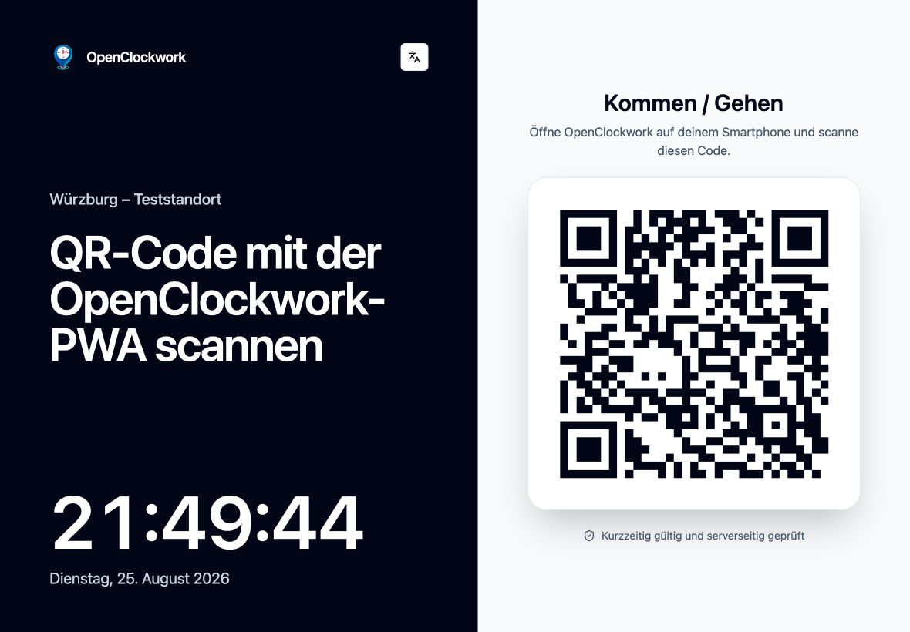
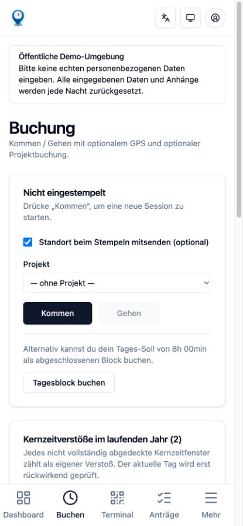
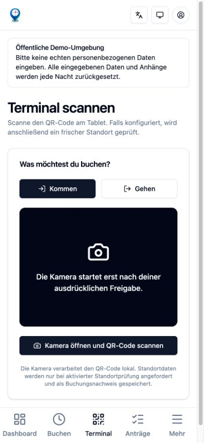
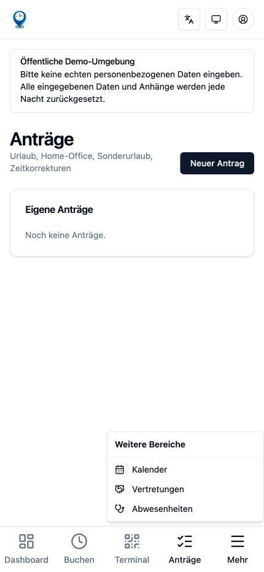
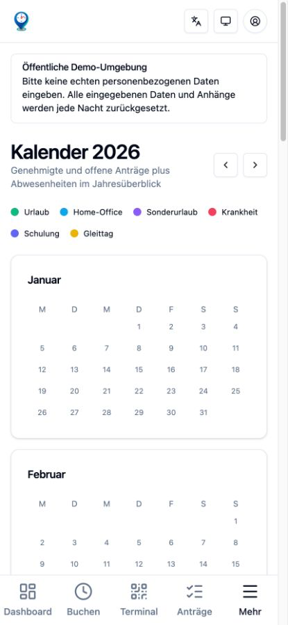
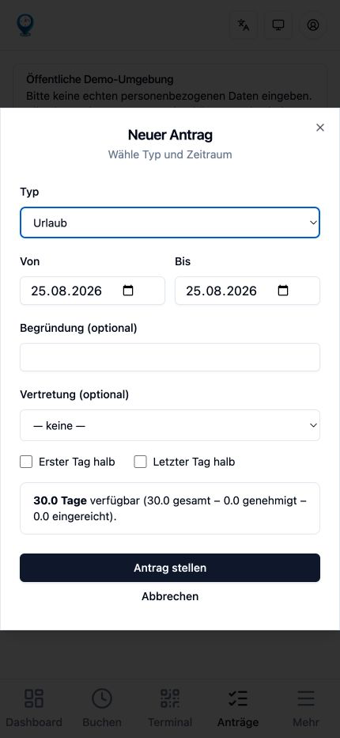
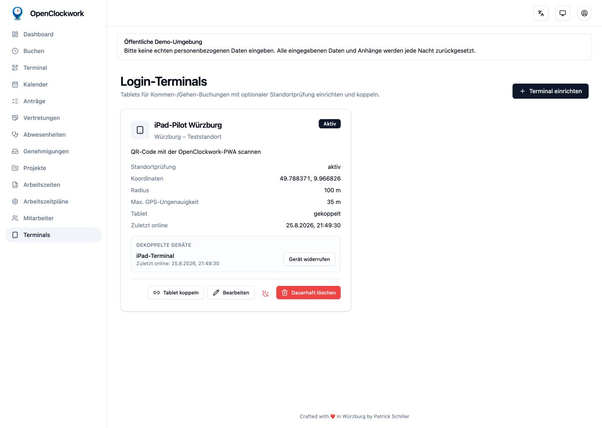
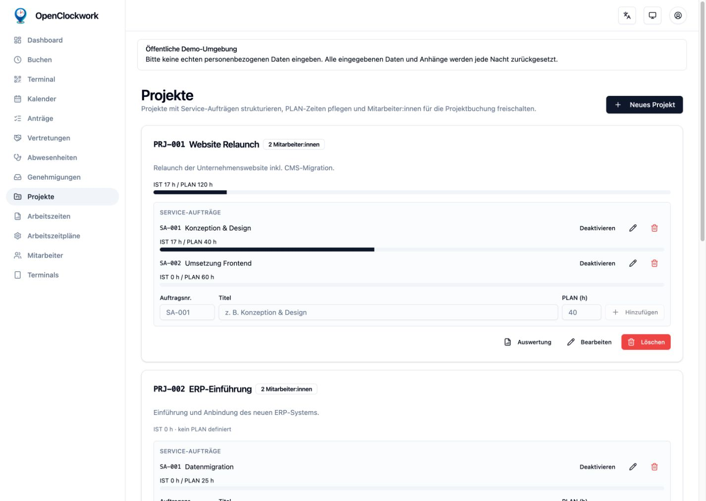

# OpenClockwork Features

OpenClockwork is a responsive, self-hostable time-and-attendance system for
employees, managers, HR administrators, and paired tablet terminals. Its domain
model supports configurable working-time workflows across countries while keeping deployment,
data, and integrations under the operator's control.

> **Project status:** Stable. Published versions follow semantic versioning and
> include release notes, forward-only database migrations, and documented
> upgrade steps. The capabilities below are implemented and covered by
> automated tests.

For planned Solo mode, invoice creation, and CAUR-based agent billing, see the
[project roadmap](ROADMAP.md).

<p align="center">
  
</p>

<p align="center">
  
  
  
</p>

## At a glance

| Audience          | Main capabilities                                                                                                                   |
| ----------------- | ----------------------------------------------------------------------------------------------------------------------------------- |
| Employees         | Clock in/out, scan tablet QR codes, book daily targets, manage requests and absences, view calendars and time accounts              |
| Managers          | Review team requests, handle substitute workflows, approve or return corrections, use bulk actions, inspect project data            |
| HR administrators | Manage employees, schedules, leave, projects, reports, terminal kiosks, geofences, devices, and production bootstrap                |
| Kiosk devices     | Pair once, display a branded rotating challenge, refresh automatically, report health, and operate with least-privilege credentials |
| Integrations      | Consume documented REST endpoints, generated types, realtime events, ERP exports, and health checks                                 |

## Mobile PWA

The React application is installable as a Progressive Web App and adapts down
to narrow phone screens without horizontal scrolling. The compact profile icon
opens an identity menu with name, email, role, and logout. German and English
can be switched from the login, employee shell, and kiosk.

The primary phone navigation is intentionally task-focused:

1. Dashboard
2. Booking
3. Terminal
4. Requests
5. More

Calendar, substitutes, absences, approval inboxes, project areas, and HR
administration remain reachable through the role-aware **More** menu.

<p align="center">
  
  
</p>

## QR tablet terminals

OpenClockwork turns a standard tablet into a shared, branded time-clock display
without requiring RFID badges, proprietary readers, or biometrics. The mounted
device never acts as an employee and cannot call normal HR or time-entry APIs.

<p align="center">
  
</p>

| Capability             | What it provides                                                                                                                      |
| ---------------------- | ------------------------------------------------------------------------------------------------------------------------------------- |
| Terminal configuration | Internal name, visible location, custom message, optional PNG/JPEG/WebP logo, IANA time zone, and active state                        |
| Optional GPS           | Run without any geofence, or require a fresh position inside a configured radius and maximum accuracy                                 |
| One-time pairing       | Short-lived code and kiosk URL; a new pairing revokes the previous active device                                                      |
| Kiosk PWA              | Dedicated manifest and full-screen view with time, date, location, custom branding, connection state, and automatic challenge refresh |
| Employee scanner       | Explicit clock-in or clock-out choice, camera preview, local QR decoding, and GPS only when the terminal requires it                  |
| Device operations      | Last-seen monitoring, re-pairing, immediate device revocation, terminal deactivation, and permanent deletion                          |
| Time-zone handling     | IANA selection with the browser timezone suggested, UTC fallback, and server-side validation                                          |
| Durable audit trail    | Historical bookings retain terminal/GPS evidence snapshots even when kiosk-only records are removed                                   |

The local iPad pilot includes a trusted-HTTPS Compose overlay, generated test
CA/server certificates, loopback-only raw service ports, an Nginx TLS gateway,
Guided Access guidance, a site acceptance checklist, and MDM recommendations.
See [the German iPad setup guide](docs/IPAD_TERMINAL_SETUP.de.md).

## Employee experience

| Capability                        | What it provides                                                                                                |
| --------------------------------- | --------------------------------------------------------------------------------------------------------------- |
| Personal dashboard                | Leave balance, overtime account, current booking, open requests, and detected core-time violations              |
| Clock in and out                  | PWA booking with optional GPS, project/service-order selection, and recent booking history                      |
| QR terminal booking               | Scan a short-lived kiosk challenge and let the server validate identity, replay state, and optional geofence    |
| Direct daily-target block         | With per-employee HR permission, book the contractual daily target as one completed and directly approved block |
| Core-time violation details       | Date, affected core window, violation type, boundary, and uncovered minutes                                     |
| Project and service-order booking | Book only to assigned active projects; active service orders become the required booking level                  |
| Activity per booking              | Store a customer-facing description of the work performed                                                       |
| Retroactive booking changes       | Change project/service-order/activity on completed and approved entries                                         |
| Entry splitting                   | Split a closed entry at a chosen time when work changes between projects                                        |
| Retroactive range booking         | Assign a past interval to a project; coverage is validated and existing entries are split as required           |
| Automatic break accounting        | Configurable schedule thresholds and deductions; no automatic deduction for new schedules by default            |
| Time accounts                     | Calculated target hours, actual hours, overtime, and opening balances                                           |
| Annual calendar                   | Year view for vacation, home office, special leave, sickness, training, and flextime                            |
| Requests                          | Vacation, home-office, special-leave, and time-adjustment workflows                                             |
| Half-day vacation                 | Independent first-day and last-day half-day selection                                                           |
| Live leave preview                | Available, approved, submitted, and calculated leave shown while creating a request                             |
| Substitute inbox                  | Accept or decline requests when named as a substitute                                                           |
| Absence records                   | Record sickness, training, and flextime days without mobile layout overflow                                     |
| Theme preference                  | Light, dark, or operating-system theme                                                                          |

## Approval workflows

OpenClockwork models approvals as explicit state transitions instead of one
approved/rejected flag.

```text
Employee submits
  -> optional substitute confirmation
  -> manager approval
  -> optional HR confirmation
  -> approved
```

- Manager and HR inboxes from desktop and mobile navigation
- Substitute acceptance and rejection
- Manager approval, rejection, and return for correction
- HR confirmation and rejection
- Bulk approval and rejection
- Request cancellation
- Complete workflow-event history
- Special approval for bookings and corrections outside configured frames
- Local-filesystem or Azure Blob attachments for supported request types
- Daily-target blocks bypass the workflow only when HR enables the employee and
  all schedule, holiday, absence, conflict, frame, and break checks pass

## HR and administration

| Capability              | What it provides                                                                                       |
| ----------------------- | ------------------------------------------------------------------------------------------------------ |
| Employee management     | Create, edit, deactivate/reactivate, reset passwords, assign managers, and control direct daily blocks |
| Roles                   | Employee, Manager, and HRAdmin access levels with role-aware navigation and endpoint guards            |
| Time models             | Full-time, part-time, trust-based working time, and flextime                                           |
| Work schedules          | Working-day masks, permitted frames, and multiple named core-time windows                              |
| Schedule assignment     | Assign individual schedules or bulk-assign by time model                                               |
| Leave allowances        | Base leave, carry-over, adjustments, expiry dates, and adjustment reasons                              |
| Holiday calendars       | Optional regional presets and custom dates used in target hours and vacation calculations              |
| Absence administration  | Record and review sickness, training, and flextime entries                                             |
| Approval operations     | Manager/HR inboxes, bulk actions, correction loops, and workflow history                               |
| Terminal administration | Configure, activate, pair, monitor, revoke, re-pair, deactivate, or permanently delete tablet kiosks   |
| Working-time reports    | HR-only start, end, break, gross, net, approval, and CSV reporting, with optional clocking locations   |

Production starts with an empty database. The interactive
`prisma/create-admin.ts` bootstrap creates exactly one first HR administrator,
prints a random initial password once, and refuses to run after any employee has
been created.

## Project management and reporting

Projects combine employee assignments, service orders, planned hours, actual
bookings, and customer-facing activity reports in one administrative workflow.

<p align="center">
  
</p>

- Project number, title, description, lifecycle, and optional PLAN hours
- Employee-by-project assignment matrix controlling booking eligibility
- Active/inactive service orders with their own PLAN hours
- PLAN/IST progress indicators at project and service-order level
- Protection against deleting referenced projects or service orders
- Detailed evaluations filtered by period, employee, project, and order
- Customer-facing activity report and CSV export
- Project-independent HR working-time report for all closed, non-rejected entries
- Opt-in clock-in and clock-out locations in the report table and CSV export,
  combining durable terminal labels with available GPS coordinates and accuracy

Exports contain employee names and working-time data and must be handled as
personal data under the organisation's access and retention policies. Exact
clocking locations are excluded by default and require an explicit HR action;
operators must document a lawful purpose and suitable retention period before
using them.

## Configurable working-time rules

Working-time rules are visible in code and covered by focused tests. Operators
remain responsible for validating their organisation's exact policies.

- Configurable break calculation with explicit thresholds and deduction minutes
- Target/actual accounting derived from weekly hours and working-day masks
- Opening overtime balances and employee start dates
- Configurable working frames and multiple core-time windows
- Direct daily-target validation against holidays, absences, requests, existing
  entries, permitted frames, and automatic breaks
- Detailed core-time violation detection
- Special approval handling for out-of-frame entries
- Working-day and selected-holiday aware vacation calculation
- Half-day leave and carry-over expiry processing
- Multi-stage request workflows and workflow events

New employees start with no regional holiday preset and no assumed annual leave
entitlement. German state calendars remain optional presets; custom dates
support other national, regional, or company calendars. New schedules start
without automatic break deduction. Upgrade migrations preserve existing
employee calendars and break policies.

Working-day and schedule calculations use the deployment's configured `TZ`
(UTC by default). Per-employee working timezones and more built-in regional
calendars are planned; see [ROADMAP.md](ROADMAP.md). Operators must validate
local rules and calendar coverage for each period in use.

## Languages, accessibility, and responsive design

- German and English UI across login, employee, manager, HR, and kiosk routes
- Central translation catalogue for labels, validation, states, and empty views
- Browser-language detection with English fallback and regional date formatting
- Persistent language and theme preferences
- Keyboard-operable account and mobile overflow menus
- Semantic labels for navigation, forms, buttons, progress indicators, and QR
  images
- Tested mobile breakpoints at 320 px and 375 px without horizontal overflow

## Security and data handling

- JWT access/refresh authentication for interactive users
- Employee identity taken from the authenticated token for live booking APIs
- Role-based guards for employee, manager, and HR endpoints
- Dedicated API-key protection for machine-to-machine ERP exports
- Authenticated Socket.IO connections
- Password hashing and refresh-token rotation
- Separate `TERMINAL_QR_SECRET` for kiosk pairing and QR signing material
- Hash-only device credential storage and immediate revocation
- Short-lived challenges, daily key rotation, rate limiting, expiry, and
  per-employee replay protection
- Optional server-enforced geofences with maximum-accuracy validation
- Historical position/accuracy/radius snapshots retained when a terminal is
  deleted; pairing codes, devices, credentials, and QR challenges are removed
- Pluggable attachment storage using local volumes or Azure Blob Storage
- Public demo reset controls that are explicitly disabled by default

OpenClockwork provides technical controls, but operators remain responsible for
TLS, secrets, access policy, legal basis, retention, backups, monitoring, and
incident response.

## API and integrations

The generated and committed OpenAPI specification lives at
[`apps/api/openapi.json`](apps/api/openapi.json).

- Authenticated employee clock-in/out and terminal scanning
- HR terminal/device lifecycle endpoints and least-privilege kiosk endpoints
- Employee daily-target capability and direct-block creation
- Paginated ERP time-entry exports with project, service-order, and activity
  references
- Socket.IO events for realtime client refreshes
- Health endpoint for deployment checks
- Generated TypeScript client types for the web application
- Language-neutral API values translated by the web catalogue

## Self-hosting and operations

- Dockerfiles for API and web applications
- Development and production Docker Compose configurations
- Trusted-HTTPS iPad overlay with runtime-configuration validation
- PostgreSQL with versioned Prisma migrations
- Synthetic seed data for local evaluation only
- Empty production bootstrap with a one-time HR admin command
- Azure Container Apps, ACR, PostgreSQL Flexible Server, Key Vault, Blob
  Storage, and Log Analytics reference infrastructure
- Dedicated terminal QR secret in Compose and Azure Key Vault
- Stable versioned images and documented backup/migration/rollback procedures
- Nx targets for lint, type-check, build, unit, integration, E2E, and browser
  tests

## Voluntary support

The complete application and tablet terminal are Apache-2.0 software. A
one-time optional support prompt may appear to HR after the first terminal
activation; dismissing it never changes functionality. `SUPPORT_URL` can point
to another trusted HTTPS page or be empty. No payment state, entitlement, or
installation identity is sent back to OpenClockwork.

## Explore the project

- [Main README and installation guide](README.md)
- [Roadmap: Solo mode, invoices, and CAUR-based agent billing](ROADMAP.md)
- [Set up and test an iPad terminal](docs/IPAD_TERMINAL_SETUP.de.md)
- [Upgrade an existing installation](UPGRADING.md)
- [Review published releases](https://github.com/patrickschiller/openclockwork/releases)
- [Contribute with DCO sign-off](CONTRIBUTING.md)
- [Review the security policy](SECURITY.md)
- [Inspect the OpenAPI specification](apps/api/openapi.json)
