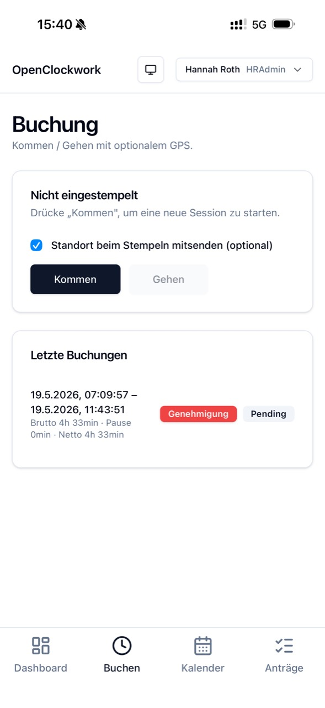
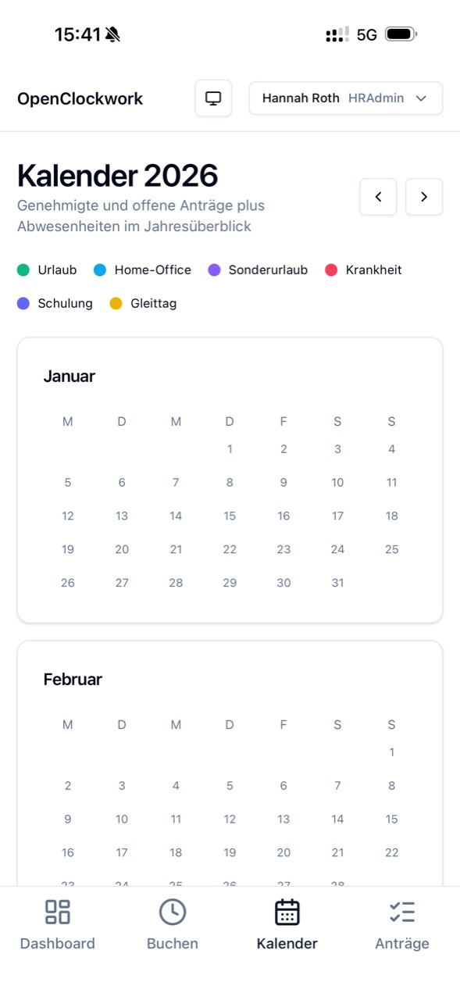
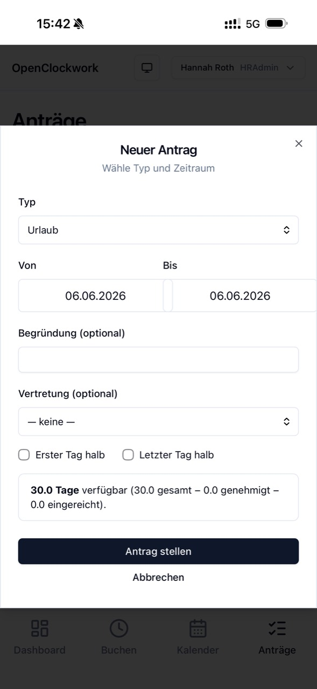

# OpenClockwork

> Open-source digital time-and-attendance management — **Zeiterfassung** done right, on a modern web stack.

[](LICENSE)
[](CONTRIBUTING.md#developer-certificate-of-origin-dco)
[](https://github.com/patrickschiller/openclockwork/releases/latest)

OpenClockwork is a self-hostable working-time tracker for small and mid-sized organisations. Employees can clock in and out or, when HR enables the option for them, book their contractual daily target as one completed and directly approved block. OpenClockwork models real-world German labour-law requirements (statutory break deduction, _Soll/Ist_ hour accounts, vacation balances, multi-stage approval workflows for _Urlaub_, _Home-Office_, _Sonderurlaub_, _Zeitanträge_) — but it is built to be useful anywhere that needs a credible alternative to commercial _Zeiterfassung_ products.

The project is intentionally small in scope and opinionated in its choices, so a single developer or a small team can stand it up, run it, and trust the numbers.

<p align="center">
  
  
  
</p>

<p align="center">
  <strong>Mobile-first PWA for employees, managers, and HR.</strong><br>
  <a href="FEATURES.md">Explore the complete feature overview</a>
</p>

## Project status

**Stable and ready for self-hosting.** The core employee, manager, HR,
approval, reporting, and self-hosting workflows are covered by automated tests.
Stable releases follow semantic versioning and include release notes and upgrade
instructions. Operators must still validate organisation-specific working-time
rules, integrations, security requirements, backups, and operating procedures.

See the [latest GitHub Release](https://github.com/patrickschiller/openclockwork/releases/latest)
and read [UPGRADING.md](UPGRADING.md) before changing an existing installation.

## Why another time tracker?

Most off-the-shelf systems are either cheap-and-cheerful punch clocks that ignore German labour law, or enterprise _Zeitwirtschaft_ suites priced for HR departments with budget. OpenClockwork sits in the middle:

- **Lawful by construction.** Statutory break deduction, detailed core-hour violation reporting, and the 07:00 / 23:00 approval threshold are encoded in the domain layer, not bolted on by the customer.
- **Flexible time capture.** Employees can use the clock for their actual start and end times or, with an explicit per-employee permission, book the daily target as a single block without an approval request. The block still observes the work schedule, public holidays, absences, existing entries, frame times, and automatic break rules.
- **Self-hostable.** PostgreSQL + a Node backend + a static web client. No SaaS lock-in; your data stays on your infrastructure.
- **PWA-first mobile experience.** Employees clock in and out from their phones with optional GPS, while role-aware mobile navigation keeps manager and HR approval workflows accessible — no app-store gatekeeper, no native build pipeline.
- **Multilingual by design.** The user interface is available in German and English, with a persistent language switcher and a central translation catalogue that makes additional languages straightforward to maintain.
- **API-first.** The web client is just one consumer of the public REST + WebSocket API. ERP integration is a first-class endpoint, not an afterthought.
- **Open source under Apache 2.0.** Fork it, embed it, sell support around it. See [LICENSE](LICENSE) and [NOTICE](NOTICE) for the terms.

See the [complete feature overview](FEATURES.md) for employee, manager, HR, integration, and deployment capabilities.

## Tech stack

| Layer     | Technology                                                            |
| --------- | --------------------------------------------------------------------- |
| Workspace | Nx monorepo (pnpm)                                                    |
| Frontend  | React 19, Vite, Tailwind CSS, shadcn/ui, central DE/EN i18n catalogue |
| Backend   | NestJS (Node.js, TypeScript strict)                                   |
| Database  | PostgreSQL with Prisma ORM                                            |
| Realtime  | Socket.IO (NestJS WebSocket gateway)                                  |
| Tests     | Vitest (web), Jest (api), Playwright                                  |
| Quality   | Nx lint, type-check, and test targets                                 |

## Repository layout

```
apps/
  api/            NestJS service: REST, WebSocket gateway, Prisma client
  web/            React + Vite + Tailwind + shadcn PWA
libs/
  shared/         Shared TS types and pure-TS domain functions
prisma/           Prisma schema and migrations (single source of DB truth)
infra/            Reference deployment infrastructure
```

## Getting started (development)

Prerequisites: **Node 20+**, **pnpm 9+**, **Docker** (for the local PostgreSQL).

### Option A: Node.js + Docker (classic dev workflow)

```bash
# Clone
git clone https://github.com/patrickschiller/openclockwork.git
cd openclockwork

# Install dependencies
pnpm install

# Boot a local Postgres
docker compose up -d db

# Apply migrations and seed
pnpm prisma migrate dev

# Run the backend (port 3000) and the web client (port 4200) in parallel
pnpm nx run-many -t serve -p api,web
```

The Vite web client is then available at http://localhost:4200 and proxies API calls to http://localhost:3000.

The interface starts in German by default. Use the language menu on the login
screen or in the application header to switch between German and English. The
selection is stored locally in the browser.

### Option B: Full local Docker stack (containerized everything)

For a fully containerised environment — including the web frontend and API — use the provided dev compose file:

```bash
# Prepare environment variables
cp .env.dev.example .env.dev

# Build & start all services (DB → API → Web)
docker compose -f docker-compose.dev.yml --env-file .env.dev up -d --build
```

The API container applies pending migrations and seeds the development database
automatically before starting.

| Service  | URL                     | Port mapping        |
| -------- | ----------------------- | ------------------- |
| Frontend | `http://localhost:8080` | `8080:8080` (Nginx) |
| API      | `http://localhost:3001` | `3001:3001`         |
| Database | `localhost:5432`        | internal (`5432`)   |

> **Tip:** If a local PostgreSQL already binds to port `5432`, set `DB_PORT=5433` in `.env.dev` before starting the stack.
> If port `8080` is already in use, set `WEB_PORT` to another host port in `.env.dev`.

Stop the stack with `docker compose -f docker-compose.dev.yml down`. The `-v`
option also deletes persistent volumes and is only appropriate when you
explicitly want to discard the local development database.

## Production installation (step by step)

Production installations use versioned API and web images from the GitHub
Container Registry. The database starts empty: production never loads the
development/demo seed. Follow every step below to configure the installation
and create its first HR administrator.

### 1. Prepare the host and configuration

Install Docker Engine with the Docker Compose plugin, then obtain this
repository and enter its directory:

```bash
git clone https://github.com/patrickschiller/openclockwork.git
cd openclockwork
cp .env.prod.example .env.prod
```

Keep `.env.prod` private. It contains production credentials and is ignored by
Git. Do not commit it or copy it into an issue, log, or support request.

### 2. Generate independent secrets

Generate every secret separately. Run each of the following commands exactly
once and copy its output only to the variable named in the comment:

```bash
# POSTGRES_PASSWORD (use this same value in DATABASE_URL as well)
openssl rand -hex 24

# JWT_SECRET
openssl rand -hex 32

# ERP_API_KEY
openssl rand -hex 32

# CRON_API_KEY
openssl rand -hex 32
```

Open `.env.prod` in an editor and replace every `change-me` value:

- Set `OPENCLOCKWORK_VERSION` to the exact version from the GitHub Release,
  without the leading `v`. Never deploy `latest`.
- Put the first command's output into `POSTGRES_PASSWORD` and replace
  `change-me-database-password` inside `DATABASE_URL` with that exact same
  value. These two locations must match.
- Put the output of each subsequent command into its matching variable:
  `JWT_SECRET`, `ERP_API_KEY`, or `CRON_API_KEY`. These three values must all be
  different from each other and from the database password.
- Set `API_CORS_ORIGINS` to the exact URL used in the browser to open
  OpenClockwork. Include `http://` or `https://` and include the port when it is
  not the protocol default, but do not add a trailing slash or path:
  - Local installation on the default port:
    `API_CORS_ORIGINS=http://localhost:8080`
  - Public installation behind TLS:
    `API_CORS_ORIGINS=https://time.example.com`
  - If more than one browser origin is required, separate the complete URLs
    with commas and no spaces.
- Keep the volume names stable across future upgrades. Set `TZ` and `WEB_PORT`
  as required for the installation.

If a PostgreSQL password contains URL-special characters, percent-encode it in
`DATABASE_URL`. The hexadecimal command above avoids that ambiguity.

### 3. Pull and start the services

Choose exactly one of the following variants.

#### Variant A: install a published release

Use this on a production host when `OPENCLOCKWORK_VERSION` refers to an image
that has already been published to GHCR:

```bash
docker compose -f docker-compose.prod.yml --env-file .env.prod pull
docker compose -f docker-compose.prod.yml --env-file .env.prod up -d
```

#### Variant B: test the current local source tree

Use this for an unpublished branch or local `main` checkout. Do not run the
`pull` command from variant A: it would download the published release instead
of testing the local changes.

```bash
docker compose \
  -f docker-compose.prod.yml \
  -f docker-compose.prod.build.yml \
  --env-file .env.prod \
  up -d --build
```

This variant builds `openclockwork-api:local` and `openclockwork-web:local` from
the current working tree. Docker may still need to download the PostgreSQL,
Node.js, and nginx base images if they are not present locally.

The API waits for PostgreSQL and runs `prisma migrate deploy` before it starts.
Migrations create the empty production schema but never create demo employees,
projects, bookings, or known passwords.

### 4. Verify the empty installation

```bash
docker compose -f docker-compose.prod.yml --env-file .env.prod ps

docker compose -f docker-compose.prod.yml --env-file .env.prod \
  exec -T api ./node_modules/.bin/prisma migrate status

curl --fail http://localhost:8080/api/health
```

All services should be healthy, the migrations should be current, and the
health endpoint should return HTTP 200. Replace `8080` if `WEB_PORT` has been
changed. The login form is intentionally empty in production at this point.

### 5. Create the first HR administrator

Run the interactive bootstrap command from the production host. Do not add
`-T`: the command requires a terminal for its prompts.

```bash
docker compose -f docker-compose.prod.yml --env-file .env.prod \
  exec api node --import tsx prisma/create-admin.ts
```

Enter the administrator's personnel number, name, email address, time model,
weekly hours, annual leave, start date, and German state. Defaults are shown in
square brackets and can be accepted with Enter.

The command creates exactly one active `HRAdmin` and prints a random initial
password once. Store that password in the organisation's approved password
manager. The command refuses to run if any employee already exists, and it
never imports the demo seed.

### 6. Sign in and replace the initial password

1. Open the configured public URL (or `http://localhost:8080` while testing
   directly on the host; use the configured `WEB_PORT` if it differs).
2. Sign in with the email address and generated initial password from step 5.
3. Open **Administration → Employees**, select the key action for your own
   account, and set a new unique password of at least eight characters.
4. Sign out and sign in again with the new password before discarding the
   initial password.

### 7. Finish the organisation setup

Review the new administrator's employee master data, then create the required
work schedules, employees, projects, and assignments through the administration
pages. Nothing from `prisma/seed.ts` belongs in a production database.

### 8. Protect the installation

Configure TLS/reverse-proxy access, database backups, and attachment backups
before entering real personal data. The PostgreSQL database and locally stored
attachments use stable named Docker volumes.

**Warning — there is no command to execute in this part of the installation.**
The following operations destroy application data and must never be used in
production: removing Compose volumes during shutdown, resetting Prisma
migrations, running the database-reset script, or running the destructive demo
reset. A normal stop or restart must always preserve the named volumes.

If the bootstrap command reports that an employee already exists, do not reset
or seed the database to work around it. Preserve a backup and investigate the
existing data; the bootstrap command is intentionally not an administrator
recovery or privilege-escalation tool.

Maintainers can build the same production-shaped stack from the current source
tree with the local override:

```bash
docker compose \
  -f docker-compose.prod.yml \
  -f docker-compose.prod.build.yml \
  --env-file .env.prod \
  up -d --build
```

For an existing installation, follow the backup, migration, verification, and
rollback procedure in [UPGRADING.md](UPGRADING.md).

## Releases

OpenClockwork uses [GitHub Releases](https://github.com/patrickschiller/openclockwork/releases)
and [Semantic Versioning](https://semver.org/). Each release contains user-facing
highlights, upgrade and database notes, breaking changes, known issues, and the
matching Docker image tags. Release tags use the `vMAJOR.MINOR.PATCH` form;
Docker images omit the leading `v`. Maintainers follow [RELEASING.md](RELEASING.md)
to prepare and publish a release.

## Public demo deployment

The Azure reference deployment can run as an ephemeral public demo in West
Europe. Set `environment = 'demo'` and `enableDemoReset = true` in the Bicep
parameters. A scheduled Container Apps job then deletes all application rows
and uploaded attachment blobs every night before recreating the seed data.
The checked-in example keeps the reset disabled. Copy
`infra/azure/main.example.bicepparam` to the gitignored
`infra/azure/main.bicepparam`, replace every `CHANGE-ME-*` placeholder locally,
and never commit that file.

The reset is intentionally destructive and guarded by two explicit environment
variables. Never enable it for staging or production. A public demo must also
carry a visible notice that visitors must not enter real personal data:

- Database backups can retain deleted rows for the configured Azure PostgreSQL
  backup-retention period.
- Logs and browser caches may outlive the nightly reset.
- Use synthetic demo accounts only; do not connect production integrations.

The reset schedule uses UTC. The example configuration runs at `03:00 UTC`.

## Contributing

Contributions are very welcome. Please read [CONTRIBUTING.md](CONTRIBUTING.md) for the workflow and the [Developer Certificate of Origin](https://developercertificate.org/) requirement (every commit must be `Signed-off-by:` your real name).

For bugs and feature ideas, open a GitHub issue. For security vulnerabilities, follow the private process in [SECURITY.md](SECURITY.md).

By participating, you agree to abide by the [Code of Conduct](CODE_OF_CONDUCT.md).

## License

OpenClockwork is licensed under the [Apache License 2.0](LICENSE). See [NOTICE](NOTICE) for required attribution when redistributing or building derivative works.

The name "OpenClockwork" and any associated marks are trademarks of the project authors. The Apache License grants no right to use them beyond honest origin attribution.

## Acknowledgements

OpenClockwork is created and maintained by [Patrick Schiller](https://github.com/patrickschiller) and the open-source contributors listed in the project's commit history.
